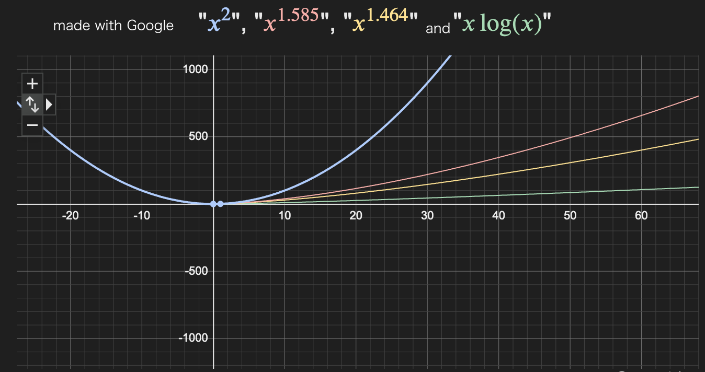

# here you are in multiplier advanced methods

## requirements 

- additions
- substractions

somewhere else in this repository
(maybe WIP or not finished yet)
 else you can use the default way (the simplest one)

## known algorithms

| **Algorithm**                   | **Complexity**                    | **aproximations**        |**implentation link**|
|---------------------------------|-----------------------------------|--------------------------|---------------------|
| **naive method/defalut**        | O(n2)                  | = n2          |soon                 |
| **Karatsuba**                   | O(nlog(3)/log(2))      | ≈ n1.585      |soon                 |
| **Toom-Cook (Toom-3)**          | O(nlog(5)/log(3))      | ≈ n1.464      |soon                 |
| **Schönhage-Strassen (FFT)**    | O(n\*log(n)\*log(log(n)))         | ≈ n\*log(n)\*log(log(n)) |soon                 |
| **Fürer (theoretical optimal)** | O(n\*log(n))                      | ≈ n\*log(n)              |soon                 |

graph available at [this](https://www.google.com/search?q=x%5E%282%29%2C++++++++x%5E%281%2C585%29%2C+x%5E%281%2C464%29%2C+x*log%28x%29&sca_esv=82f58710a97753db&sxsrf=ADLYWIJraRg5vd5wNTJmg8NQkrAETTkZuw%3A1735927503573&ei=zyZ4Z5fAIquFxc8PqvywmQc&ved=0ahUKEwjX49LxkdqKAxWrQvEDHSo-LHMQ4dUDCBA&uact=5&oq=x%5E%282%29%2C++++++++x%5E%281%2C585%29%2C+x%5E%281%2C464%29%2C+x*log%28x%29&gs_lp=Egxnd3Mtd2l6LXNlcnAiLHheKDIpLCAgICAgICAgeF4oMSw1ODUpLCB4XigxLDQ2NCksIHgqbG9nKHgpMgoQABiwAxjWBBhHMgoQABiwAxjWBBhHSKsFUPQDWPQDcAF4AZABAJgBAKABAKoBALgBA8gBAPgBAZgCAaACAJgDAIgGAZAGApIHATGgBwA&sclient=gws-wiz-serp) google page

sources : 

- [Karatsuba algorithm, YT channel by __PurpleMind__](https://www.youtube.com/watch?v=AMl6EJHfUWo)
- Furer's work : [educational PDF document from himself](https://ivv5hpp.uni-muenster.de/u/cl/WS2007-8/mult.pdf)

- 
<!--end page-->
